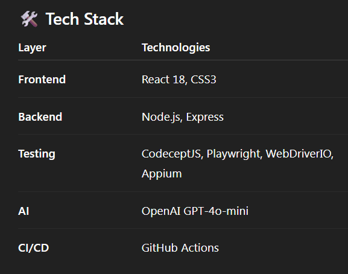
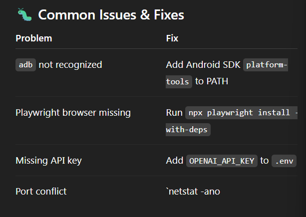

# 🧪 DateTimeChecker — Complete Testing Suite

**Multi-platform testing framework** for the **Date & Time Validator** app, integrating **E2E**, **API**, **Mobile App**, and **AI-powered test generation** for full automation coverage.

---

### CI/CD TEST SPACE

---

## 🚀 Live App

**🌐 Production:** [https://dtchman.netlify.app](https://dtchman.netlify.app)

---

## 🧩 Testing Types

| Type      | Tech Stack              | Description                           |
| --------- | ----------------------- | ------------------------------------- |
| 🖥️ E2E    | CodeceptJS + Playwright | Browser automation on production site |
| 🔌 API    | CodeceptJS REST         | Backend endpoint validation           |
| 📱 Mobile | WebDriverIO + Appium    | Real Android device testing           |
| 🤖 AI     | OpenAI GPT-4o-mini      | Test generation and analysis          |

---

## ⚙️ Quick Start

### 1️⃣ Installation

```bash
git clone https://github.com/amberr147/DTC_AI_Testing-.git
cd DTC_AI_Testing-
npm install
npx playwright install --with-deps
```

### 2️⃣ Environment Setup

APP_URL=https://dtchman.netlify.app
API_URL=http://localhost:8080
OPENAI_API_KEY=your_api_key

### 3️⃣ Run Tests

npm run start:api # Start local API
npm run test:api # Run API tests
npm run test:e2e # Run E2E browser tests
npm run test:android # Run Android mobile tests
npm run generate:tests # AI test generation

### 🧱 CI/CD Workflow

Automated with GitHub Actions:

Triggers on push or PR to main or develop

Runs API, E2E, and AI test suites

Publishes test artifacts & summary reports

Pipeline Badge: https://github.com/amberr147/DTC_AI_Testing-/actions/workflows/ci-cd.yml



### 🧪 Sample Validations

✅ 15/08/2020 → “15/08/2020 is correct date time!”
❌ 32/01/2024 → “Input data for Day is out of range!”
✅ 29/02/2024 → Leap year validation
❌ 15/13/2024 → “Month is out of range!”

### 🐛 Common Issues & Fixes



### Documentation

📘 TESTING_GUIDE.md
– Detailed testing setup

🏗️ CODE_ARCHITECTURE.md
– Project architecture

📱 MOBILE_APP_TESTING.md
– Android setup guide

### 🎓 Course Info

FPT University — Software Testing (Oct 2025)
MIT License — Educational Use Only
